# Installing VScode

* You first want to head over to --> [vscode website](https://code.visualstudio.com) to download vscode

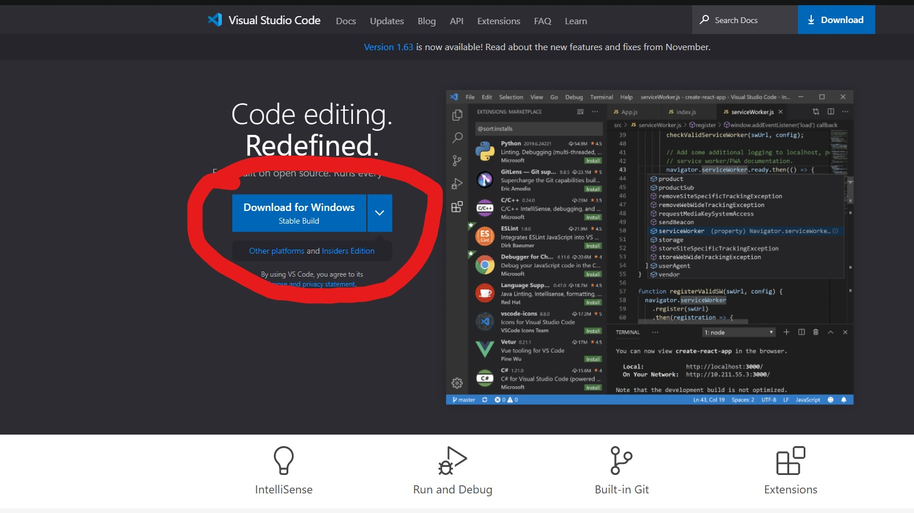

* You then want to open up visual studio code which looks like when opened:

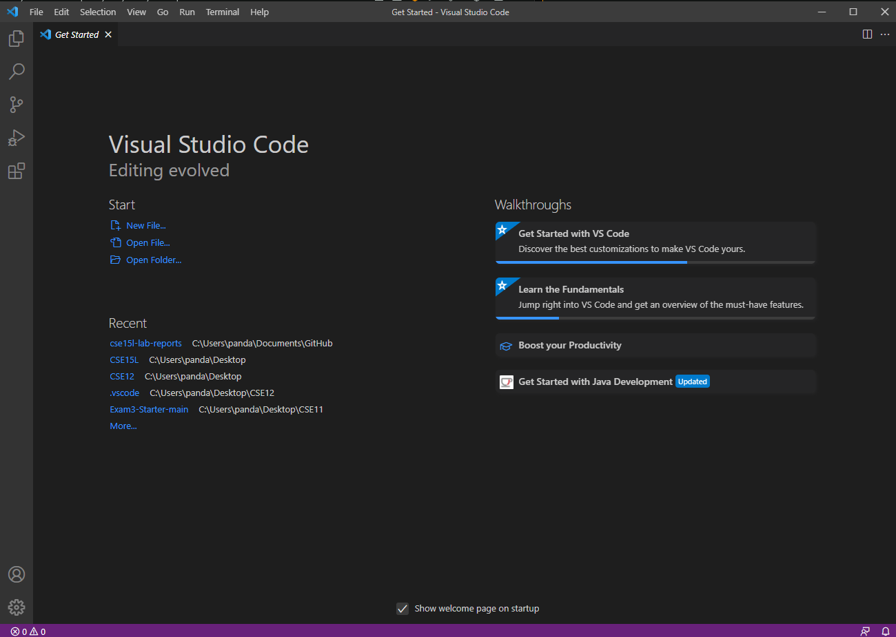

* Create a folder on your desktop named **CSE15L**
* Then open that folder in vscode (under `open file...`)
* Once you have that folder opened, head over to your **explorer** on the left and hover over CSE15L and click the new file button

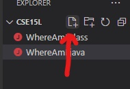

* Name the file *"connecting.java"*.
* Inside the class copy this piece of code:

```
public static void main(String[] args) {
        System.out.println("Hello Celestial Body!");
    }
```

* At the top of vscode, click **Terminal** and then **New Terminal**. This is where we will be inputting our commands to connect to the server.
* Your vscode should look something like:

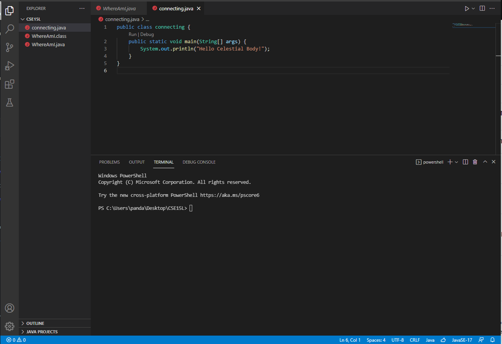

# Remotely Connecting

* Windows: Install OpenSSH which allows you to connect to other servers --> [OpenSSH](https://docs.microsoft.com/en-us/windows-server/administration/openssh/openssh_install_firstuse)

* Lookup your CSE15L account name --> [UCSD account lookup](https://sdacs.ucsd.edu/~icc/index.php)

* In your vscode terminal enter this command, but replace AAA with your account specific letters:

`ssh cs15lwi22AAA@ieng6.ucsd.edu`

* A block of text should show up, just type *yes* into the terminal and then enter the password
* After sucessfully entering your password, your terminal should look like this:

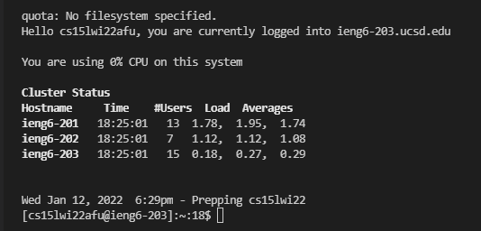

* You have now connected to the basement computers at UCSD

# Trying Some Commands

* Create a new terminal. You now have one terminal connected to the server *ssh* and another that is running on your computer *powershell*

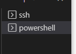

* Try these commands on both the server and client terminals
* `cd ~`
* `cd`
* `ls -lat`
* `ls -a`
* `pwd`

* If you ever want to leave the server just run `exit`

---

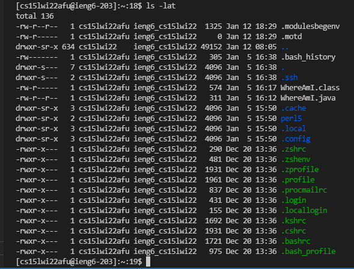\
example of ls -lat command in server

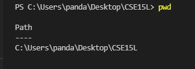\
example of pwd command in client

# Moving Files with scp

* Go ahead and logout of the server

* Now we are going to copy the *connecting.java* file over to the server

* In the terminal run this command: **(remember to change AAA to your specific letters)**

`scp connecting.java cs15lwi22AAA@ieng6.ucsd.edu:~/` 

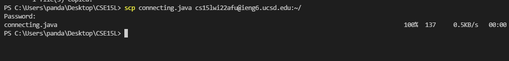

* Reconnect to the ieng6 server normally with `ssh` and check the files with the `ls` command.

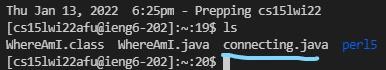

* In the server run the file with `javac` and `java`

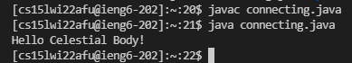

# Setting an SSH Key

* We will now generate an SSH Key to make connecting to the server more streamlined
* Run the `ssh-keygen` command
* When it asks for the file location, just hit enter
* Enter any passphrase that you will rememeber

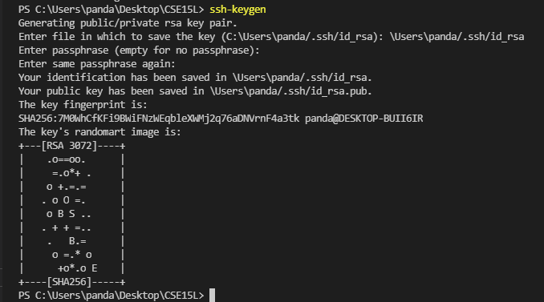

* **ONLY DO THIS STEP ON WINDOWS!**
* Run vscode as **ADMIN** 
* run `Get-Service ssh-agent | Set-Service -StartupType Manual`
* run `Start-Service ssh-agent`
* run `Get-Service ssh-agent`

* You will now run `ssh-add \Users\USERNAME/.ssh/id_rsa` but replace `USERNAME` with your username
* Enter the passphrase you used to create the keygen

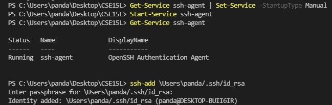

* Reconnect into the server and run `mkdir .ssh`

* To copy the key over to the server you will run `scp \Users\USERNAME/.ssh/id_rsa cs15lwi22AAA@ieng6.ucsd.edu:~/.ssh/authorized_keys` in your client

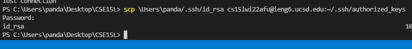

# Optimizing Remote Running

* after an `ssh` command, you can include another command in **quotes** " " to run commands much faster


* you can use semicolons **;** to run multiple commands in one line


