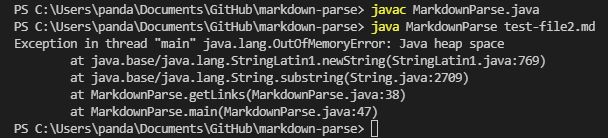
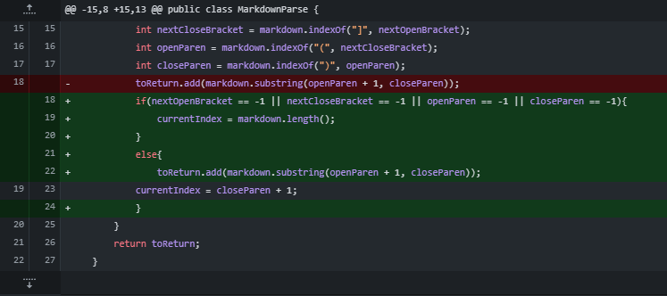
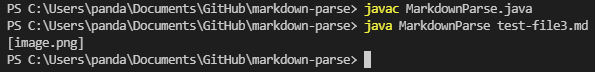
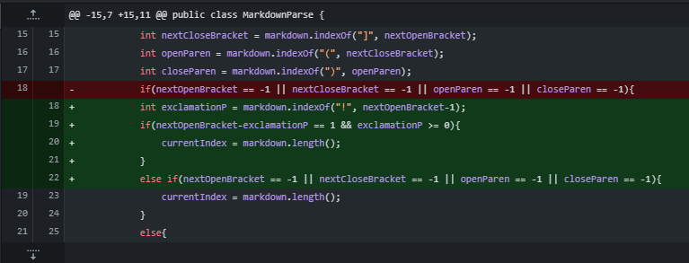
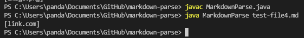
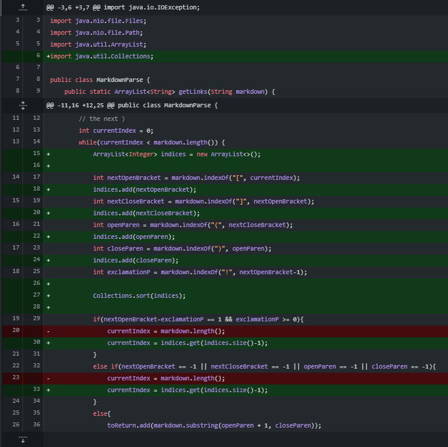

# Code Change 1

- link to test file causing failure ->
[Link To Test File 2](https://github.com/HyperBlitzer/markdown-parse/blob/main/test-file2.md)

- screenshot of failure it caused

- code to fix the failure

### Relationship with Bug, Symptom, and Failure-Inducing Input

- The **input** that broke the code included text after the link
- The **symptom** was that the getLinks method went on an infinite loop since index kept resetting to 0
- The **bug** was that there was no way to check if a bracket or parenthesis was not found

---

# Code Change 2

- link to test file causing failure ->
[Link To Test File 3](https://github.com/HyperBlitzer/markdown-parse/blob/main/test-file3.md)

- screenshot of failure it caused

- code to fix the failure

### Relationship with Bug, Symptom, and Failure-Inducing Input

- The **input** that broke the code used markdown syntax for an image instead of a link
- The **symptom** was that getLinks returned the image file name
- The **bug** was that there was no way to check if an exclamation point preceded the opening bracket

---

# Code Change 3

- link to test file causing failure ->
[Link To Test File 4](https://github.com/HyperBlitzer/markdown-parse/blob/main/test-file4.md)

- screenshot of failure it caused

- code to fix the failure

### Relationship with Bug, Symptom, and Failure-Inducing Input

- The **input** that broke the code contained an image reference inbetween two files 
- The **symptom** was that getLinks only got the first link
- The **bug** was that if getLinks found something that **was not** a link, it would end the while loop

---
